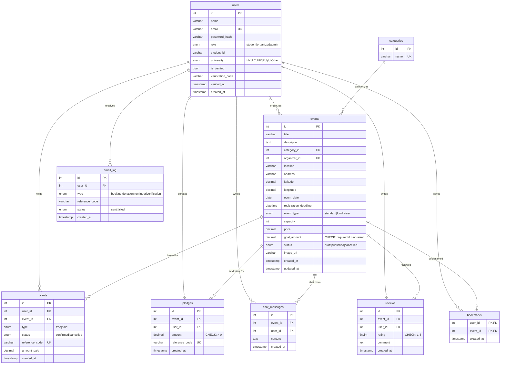

# Campus Hub — Database ER Diagram

Paste the block below into the [Mermaid Live Editor](https://mermaid.live) to view/export.

## Legend

- `PK` — primary key
- `FK` — foreign key
- `UK` — unique constraint
- `PK,FK` — composite primary key that is also a foreign key
- `CHECK` — MySQL 8 check constraint (enforced on insert/update)
- `rsvps` table is intentionally absent — replaced by `tickets` (free/paid ticketing with receipt reference codes)

## Notes for reviewers

- 9 tables total: `users`, `categories`, `events`, `tickets`, `pledges`, `chat_messages`, `reviews`, `email_log`, `bookmarks`
- All FKs use `ON DELETE CASCADE` / `ON UPDATE CASCADE`
- Fundraiser progress is computed live: `SELECT COALESCE(SUM(amount),0) FROM pledges WHERE event_id = ?`
- `pledges` has no `UNIQUE(user_id, event_id)` — repeat donations are allowed by design
- Chat time-window rules (open T-6h, close +7d) are enforced in Express middleware, not in SQL
